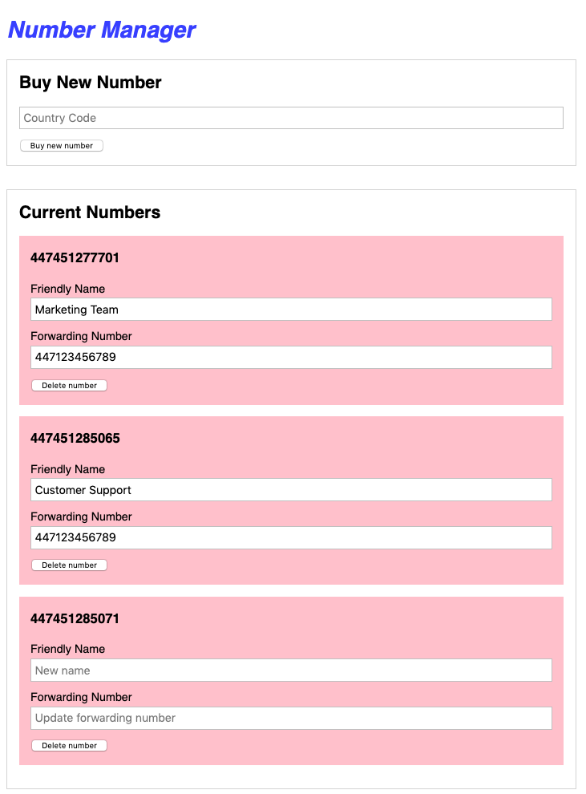

# Virtual Phone Number Pool Manager

> This application is a manager for Vonage API virtual phone numbers. With it, users can create, edit and cancel numbers.



## Set up

### Local Set Up

1. Run the following terminal commands to download the repo and oinstall dependencies

```
git clone https://github.com/nexmo-community/phone-number-pool-manager-node
cd phone-number-pool-manager-node
npm install
```

2. Populate the `.env` file with your credentials
3. In server.js, change the CORS URL and server port on the last line
4. Run `node server.js`

### Glitch Set Up

1. Click this button to create a new Glitch project based on this application<br/>
[](https://glitch.com/edit/#!/import/github/nexmo-community/phone-number-pool-manager-node)
2. Populate the `.env` file with your credentials
3. Click _Show_ at the top of your Glitch editor and open your working application

[contributing]: CONTRIBUTING.md "Contributing"

## Code of Conduct

In the interest of fostering an open and welcoming environment, we strive to make participation in our project and our community a harassment-free experience for everyone. Please check out our [Code of Conduct][coc] in full.

## Contributing
We :heart: contributions from everyone! Check out the [Contributing Guidelines][contributing] for more information.

[![contributions welcome][contribadge]][issues]

## License

This project is subject to the [MIT License][license]

[logo]: vonage_logo.png "Vonage"
[contribadge]: https://img.shields.io/badge/contributions-welcome-brightgreen.svg?style=flat "Contributions Welcome"

[coc]: CODE_OF_CONDUCT.md "Code of Conduct"
[contributing]: CONTRIBUTING.md "Contributing"
[license]: LICENSE "MIT License"

[issues]: ./../../issues "Issues"
